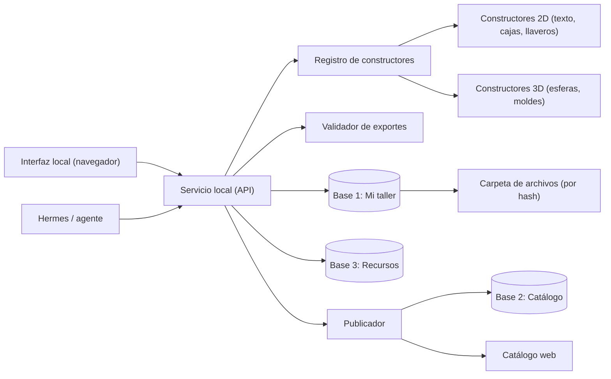
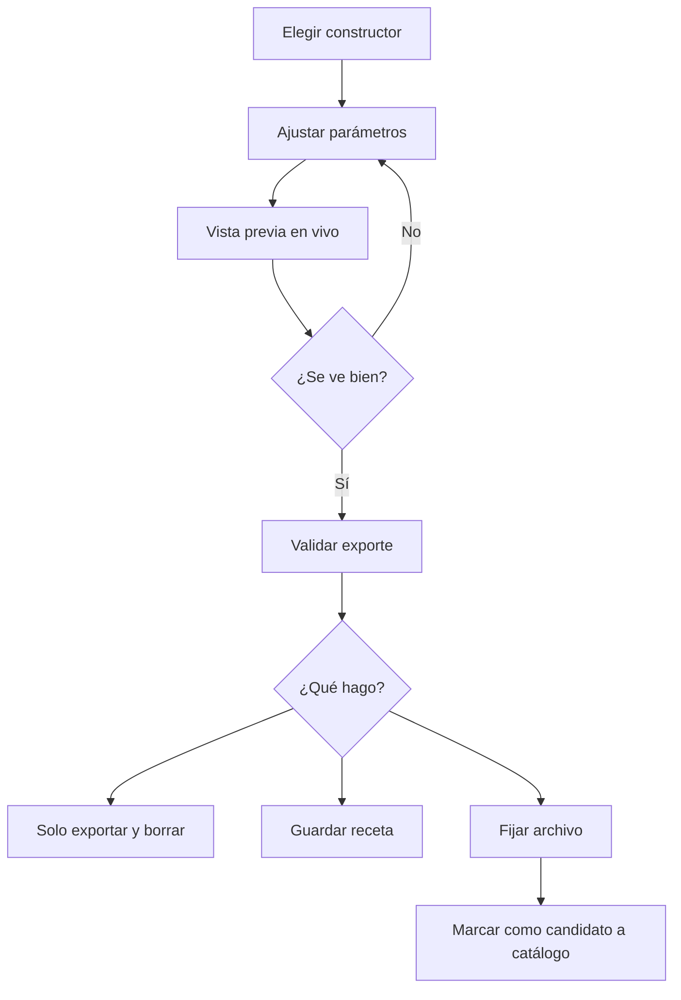

# Plan maestro — Taller Paramétrico (nombre provisional)

Documento de planeación. **No se construye nada hasta cerrar este plan.** Está pensado para uso propio en Windows, con la puerta abierta a catálogo web y a un agente (Hermes) más adelante.

---

## 1. Objetivo y principios

**Objetivo:** un taller digital que (a) genera diseños al instante con constructores paramétricos (texto conectado, esferas, llaveros, cajas, 3D…), (b) recuerda lo que has hecho, y (c) convierte lo mejor en productos listos para vender.

**Principios de diseño**

1. **Recetas, no archivos.** Un diseño se guarda como `constructor + versión + parámetros`. El archivo se regenera cuando se necesita y solo se conserva si se "fija".
2. **Un constructor = una carpeta.** Agregar o mejorar uno no toca el resto.
3. **Local primero.** Todo corre en tu PC, sin cuentas ni nube. La web y Hermes se conectan después por puertas bien definidas.
4. **Envolver, no depender.** Cada librería externa queda detrás de una interfaz propia, para poder cambiarla sin reescribir.
5. **Validar antes de confiar.** Cada exportación pasa por chequeos automáticos (cerrado, sin islas, hermético, en milímetros).
6. **Un frente a la vez.** Máximo un constructor nuevo en desarrollo.

**Fuera de alcance de la v1:** cuentas de usuarios, pagos, comunidad, app móvil, editor gráfico completo tipo Illustrator, control directo de la máquina.

---

## 2. Arquitectura general



**Capas**

| Capa | Función |
|---|---|
| Interfaz | Formularios generados desde el manifiesto de cada constructor, vista previa 2D/3D, biblioteca, cola de trabajos |
| Servicio local | Una sola puerta de entrada (HTTP en localhost). La usan la interfaz y Hermes |
| Registro de constructores | Descubre carpetas de constructores, lee su manifiesto, valida parámetros |
| Constructores | Funciones puras: parámetros → SVG / STL / 3MF / vista previa |
| Validador | Revisa el resultado antes de guardarlo o publicarlo |
| Bases de datos | Tres bases separadas (ver sección 3) |
| Publicador | Empaqueta, genera imagen de producto y envía al catálogo |

---

## 3. Las tres bases de datos

Todas en SQLite (un archivo cada una), separadas para poder compartir o respaldar cada una por su lado.

### Base 1 — Mi taller (privada)

| Tabla | Campos clave |
|---|---|
| `recetas` | id, constructor_id, constructor_version, parametros_json, nombre, estado (`borrador`, `fijada`, `archivada`), creada_en |
| `archivos` | id, hash_sha256, ruta, tipo (svg, stl, 3mf, dxf, png), tamaño, origen (`generado`, `importado`), receta_id (opcional) |
| `trabajos` | id, receta_id o archivo_id, cliente, fecha, material_id, maquina_id, notas, resultado |
| `etiquetas` / `archivo_etiqueta` | etiquetado libre |

Aquí caen tus archivos ya usados, vectores personalizados y trabajos. Los archivos viven en disco con nombre por hash (evita duplicados).

### Base 2 — Catálogo (se comparte con la web)

| Tabla | Campos clave |
|---|---|
| `productos` | id, slug, titulo, descripcion, precio, estado (`borrador`, `listo`, `publicado`), origen_receta_id, paquete_ruta |
| `imagenes_producto` | id, producto_id, ruta, tipo (`captura`, `mockup`, `render`) |
| `categorias` / `etiquetas` | clasificación |
| `publicaciones` | id, producto_id, canal (web, otro), url, fecha, version_snapshot |

**Regla:** publicar = crear un *snapshot inmutable* del producto. Así el catálogo web nunca se desincroniza de lo que realmente vendes.

### Base 3 — Recursos

| Tabla | Campos clave |
|---|---|
| `fuentes` | familia, archivo, licencia, **apta_para_venta**, sirve_para_conexion, notas |
| `materiales` | nombre, grosor_mm, kerf_mm, notas de corte |
| `maquinas` | nombre, tipo (láser, CNC, impresora 3D), área, perfil |
| `formas_base` | siluetas y piezas reutilizables |

---

## 4. Contrato de un constructor

Cada constructor es una carpeta con un manifiesto y una función.

```json
{
  "id": "esfera-nombre",
  "version": "1.0.0",
  "titulo": "Esfera con nombre",
  "salidas": ["stl", "3mf", "preview"],
  "parametros": {
    "texto":    { "tipo": "texto",  "defecto": "Sofía", "max": 24 },
    "diametro": { "tipo": "numero", "defecto": 80, "min": 30, "max": 200, "unidad": "mm" },
    "fuente":   { "tipo": "fuente", "filtro": "apta_para_venta" },
    "agujero":  { "tipo": "booleano", "defecto": true }
  }
}
```

**Reglas del contrato**

- La función es **pura**: mismos parámetros y misma versión dan el mismo resultado.
- Devuelve datos + avisos (`"aviso": "la letra ñ quedó a 0.4 mm del borde"`).
- Unidades siempre en milímetros.
- **Versionado semántico.** Si un cambio altera el resultado, sube la versión mayor. Una receta guarda la versión con la que se creó.
- Cada constructor incluye 3 a 5 casos de prueba con resultado esperado ("archivos de referencia").

---

## 5. Flujos principales

### 5.1 Generar y decidir



### 5.2 Pedido de un cliente (ej. esferas con nombres)

1. Pegas la lista de nombres (o Hermes la recibe).
2. Modo por lotes: una receta por nombre, mismos parámetros.
3. Revisión rápida de miniaturas + avisos del validador.
4. Exportas todo en una carpeta o zip con nombres ordenados.
5. Guardas el trabajo (cliente, fecha, material) y decides qué recetas conservar.

### 5.3 Publicar en el catálogo

1. Eliges una receta o archivo fijado.
2. El publicador regenera el archivo limpio con la versión actual.
3. Corre el validador.
4. Genera paquete (zip: SVG/STL/3MF + guía breve) y **imagen de producto** (mockup automático).
5. Completas título, descripción, etiquetas, precio.
6. Se crea el snapshot y se sincroniza con la web.

### 5.4 Importar tu biblioteca actual

1. Apuntas a tus carpetas.
2. Indexa por hash (detecta duplicados), genera miniaturas, lee tipo y medidas.
3. Etiquetado asistido (por nombre de carpeta y de archivo, más revisión manual).
4. Nada se mueve ni se borra en tus carpetas originales; solo se copian a la biblioteca cuando lo decidas.

---

## 6. Componentes y piezas

Las licencias hay que **verificarlas en el momento de elegir** (versiones y licencias cambian).

### 6.1 Base técnica (Windows)

| Pieza | Rol |
|---|---|
| Node.js LTS + TypeScript | Lenguaje único para interfaz, servicio y constructores 2D/3D básicos |
| Vite + React o Svelte | Interfaz local |
| SQLite (better-sqlite3) | Las tres bases |
| Tauri (opcional, más adelante) | Empaquetar como aplicación de escritorio `.exe` |
| Python 3.11/3.12 (opcional) | Solo si el 3D necesita CAD real (redondeos, roscas) |

### 6.2 Geometría y formatos

| Necesidad | Pieza candidata |
|---|---|
| Letras a contornos | opentype.js; harfbuzzjs para escrituras conectadas/cursivas |
| Uniones y offsets 2D | Clipper2 (versión WASM) |
| Diseño de piezas para láser | Maker.js |
| 3D sólido en JS | manifold-3d (WASM) + three.js para ver |
| CAD paramétrico (fase 3D avanzada) | build123d / CadQuery (Python) |
| Validar mallas | manifold (chequeo hermético) y trimesh (opcional) |
| Escribir 3MF | 3MF es un zip con XML; se puede generar directo o con lib3mf |
| Acomodo de piezas (nesting) | SVGnest o Deepnest (fase tardía) |
| Foto a vector | VTracer (fase tardía) |

### 6.3 Imágenes y publicación

| Necesidad | Pieza candidata |
|---|---|
| SVG a PNG | resvg-js o sharp |
| Mockup de producto | Plantillas de material (madera, acrílico, cuero) con el SVG encima; Blender en consola solo para 3D si se quiere realismo |
| Catálogo web | Sitio estático generado desde la Base 2 (o PocketBase si quieres panel de administración) |

### 6.4 Integraciones

| Integración | Cómo |
|---|---|
| **Hermes / agente** | Servicio local expuesto por HTTP y/o como servidor MCP. Herramientas: `listar_constructores`, `generar`, `guardar_receta`, `buscar_biblioteca`, `publicar` (con confirmación) |
| **LightBurn / software láser** | Exportes SVG con convención de capas por color (corte / marcado / grabado) documentada |
| **Laminadores (Bambu, Prusa, Orca, Cura)** | Exportes 3MF/STL; opcionalmente lanzar el laminador por línea de comandos |
| **Tienda / web** | Snapshot de producto → JSON + imágenes + zip |

---

## 7. Riesgos y fallos anticipados

| # | Riesgo | Prob. | Impacto | Mitigación |
|---|---|---|---|---|
| 1 | Las uniones de letras cursivas fallan (huecos, islas, letras sin tocarse) | Alta | Alto | Prueba temprana con 10 fuentes; reglas del validador (una sola región, sin autointersecciones); control de espaciado; alternativa por offset + unión |
| 2 | Recetas antiguas dejan de reproducir el mismo resultado | Alta | Alto | Versionado semántico, archivos de referencia por constructor, pruebas de regresión automáticas |
| 3 | STL no hermético o con caras invertidas | Media | Alto | Motor de mallas robusto, chequeo hermético obligatorio antes de exportar |
| 4 | Licencia de fuente no permite vender | Media | Alto | Campo `apta_para_venta`; por defecto solo fuentes con licencia libre; el constructor filtra |
| 5 | Kerf y tolerancias distintas por material | Alta | Medio | Perfiles de material; pieza de prueba (cupón) antes de series grandes |
| 6 | Problemas de Windows: rutas largas, sincronización OneDrive dañando SQLite, antivirus, permisos | Media | Alto | Carpeta corta fuera de OneDrive (ej. `C:\Taller`), activar rutas largas, excluir carpeta en antivirus si hace falta |
| 7 | Pérdida de la biblioteca | Media | Crítico | Respaldo automático (base + carpeta de archivos) a disco externo y nube; probar restaurar |
| 8 | El proyecto crece sin cerrar nada | Alta | Alto | Un constructor a la vez; definición de "listo" por fase; lista de espera para ideas |
| 9 | Vista previa lenta con textos largos o lotes | Media | Medio | Web Workers, caché por hash de parámetros, límites razonables |
| 10 | El mockup automático se ve poco atractivo | Media | Medio | Empezar con plantillas simples; permitir subir foto real del producto armado |
| 11 | Exportes que abren mal en LightBurn o el laminador (escala, unidades, capas) | Media | Alto | Prueba de importación por cada tipo de exporte; siempre mm y `viewBox` correcto |
| 12 | Librería abandonada o cambia de licencia | Baja | Medio | Versiones fijadas; cada librería detrás de una interfaz propia |
| 13 | Hermes ejecuta una acción destructiva (borrar, sobrescribir) | Media | Alto | API de solo lectura y generación por defecto; borrar/publicar exigen confirmación; token local |
| 14 | Datos de clientes expuestos al sincronizar | Baja | Alto | Base 1 nunca se sincroniza; solo la Base 2, sin notas de clientes |

---

## 8. Estimación de tiempos

**Supuestos:** una persona a ~10 horas por semana, con Claude apoyando en el código. Rangos con ±40 % de incertidumbre; los riesgos 1 y 3 pueden mover fechas.

| Fase | Contenido | Horas | Semanas |
|---|---|---|---|
| **0. Pruebas desechables** | Validar riesgos clave antes de construir (ver sección 9) | 8–12 | 1 |
| **1. Esqueleto** | Estructura de carpetas, 3 bases, servicio local, registro de constructores, interfaz mínima, respaldos | 15–25 | 1.5–2.5 |
| **2. Importar biblioteca** | Indexar tus archivos, miniaturas, etiquetas, búsqueda | 8–15 | 1–1.5 |
| **3. Texto conectado v1** | Más tipografías, validador, exporte SVG con capas, kerf, modo lote | 25–40 | 2.5–4 |
| **4. Constructor 3D** | Esfera con nombre, llavero 3D, exporte STL/3MF, vista previa 3D | 25–45 | 2.5–4.5 |
| **5. Publicar** | Paquete, mockup, catálogo, sincronización web | 20–35 | 2–3.5 |
| **6. Hermes / MCP** | Herramientas, permisos, confirmaciones, pruebas | 8–15 | 1–1.5 |
| **7. Ampliaciones** | Cajas, nesting, foto a vector, empaquetado `.exe` | Continuo | — |

**Hitos**

- **Primer uso real** (fases 0–3): 6–10 semanas.
- **Taller completo con 3D y catálogo** (fases 0–5): 3–4.5 meses.
- **Con Hermes integrado** (fase 6): 4–5 meses.

---

## 9. Fase 0: pruebas desechables (para reunir piezas y medir riesgos)

Son experimentos pequeños que se tiran a la basura. Su meta es responder "¿esto funciona en mi PC?" antes de invertir.

| Prueba | Pregunta que responde | Éxito si… |
|---|---|---|
| A. Unión de letras | ¿Las letras cursivas se sueldan en una sola pieza limpia con opentype.js + Clipper2? | 8 de 10 fuentes salen en una sola región, sin huecos |
| B. Mallas 3D en Windows | ¿manifold-3d genera una esfera con texto en relieve hermética? | STL abre sin errores en el laminador |
| C. Exporte a LightBurn | ¿El SVG llega en mm, a escala real y con capas correctas? | Medida real coincide y las capas se separan |
| D. SQLite + carpeta por hash | ¿Aguanta indexar tu biblioteca real sin problemas de rutas? | Indexa todo sin errores ni duplicados falsos |
| E. Miniaturas y mockup | ¿SVG a PNG sobre textura se ve presentable? | Resultado usable como imagen de producto |
| F. Servicio local + llamada externa | ¿Otra app (Hermes) puede llamar un constructor por HTTP? | Devuelve un SVG desde una llamada simple |
| G. Corte real | ¿El resultado se corta bien con el kerf configurado? | Pieza de prueba encaja como se esperaba |

Con los resultados se ajusta este plan antes de la fase 1.

---

## 10. Definición de "listo" por fase

- **Fase 1:** el servicio arranca con un doble clic, hay un constructor de ejemplo, las 3 bases se crean solas, el respaldo funciona y se puede restaurar.
- **Fase 2:** al menos el 95 % de tus archivos actuales aparecen con miniatura y se pueden buscar por nombre, tipo y etiqueta.
- **Fase 3:** 20 textos de prueba en 10 fuentes pasan el validador; el SVG abre bien en LightBurn; una pieza real cortada.
- **Fase 4:** una esfera con nombre se imprime bien; lote de 10 nombres exportado en un clic.
- **Fase 5:** un producto pasa de receta a catálogo web con paquete e imagen sin pasos manuales fuera de la interfaz.
- **Fase 6:** Hermes puede generar y buscar sin poder borrar ni publicar sin tu confirmación.

---

## 11. Decisiones abiertas (necesito tus respuestas)

1. **Máquinas y programas:** ¿qué láser, CNC e impresora 3D usas, y con qué software (LightBurn, laminador)?
2. **Tu biblioteca actual:** ¿cuántos archivos aproximadamente, qué formatos y dónde están (disco local, nube, USB)?
3. **Catálogo web:** ¿dónde vivirá (sitio propio, tienda en línea, solo enlaces)? Define cómo se publica en la fase 5.
4. **Hermes:** ¿cómo llama herramientas (HTTP, MCP, otra forma)? Define la puerta de integración de la fase 6.
5. **Horas por semana** reales que puedes dedicarle, para ajustar el calendario.
6. **Orden de prioridad:** ¿empezamos por 2D (texto conectado) o por 3D?
7. **Idioma de la interfaz:** asumo español, ¿correcto?

**Si no respondes alguna, asumo:** láser con LightBurn y una impresora 3D con laminador comercial, ~10 h/semana, empezar por 2D, catálogo como sitio estático, Hermes vía HTTP local.

---

## 12. Siguiente paso propuesto

1. Respondes las decisiones abiertas (las que puedas).
2. Yo te preparo el **plan detallado de la fase 0** (pasos exactos de cada prueba, qué instalar en Windows y en qué orden).
3. Ejecutamos las pruebas, medimos y **ajustamos este documento**.
4. Solo entonces empieza la fase 1.
